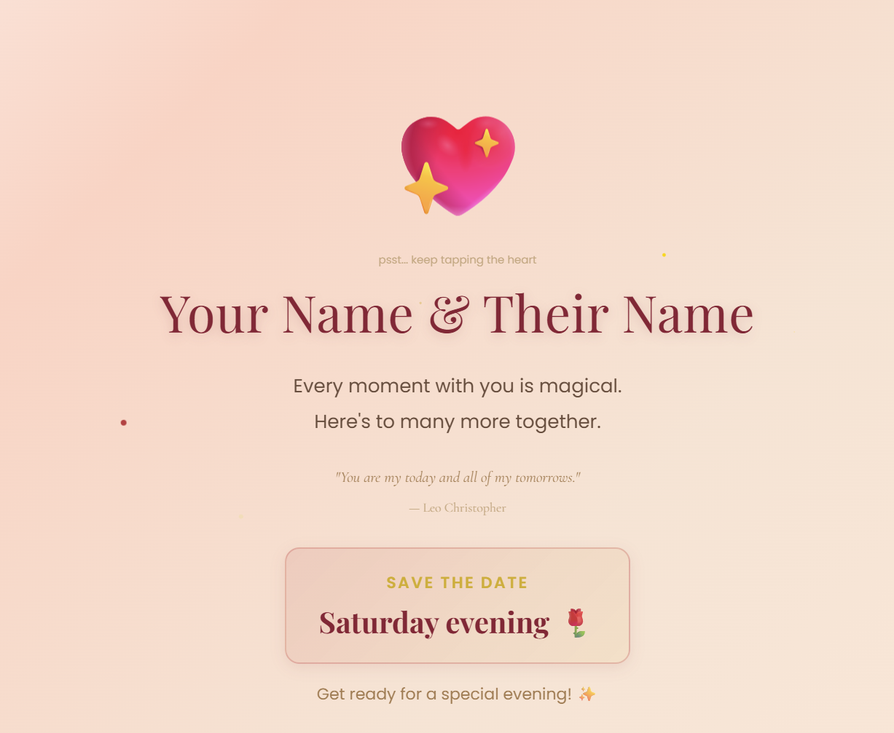

# Will You Be My Valentine? Website



A beautiful, interactive Valentine's Day website you can make your own and send to someone special — in just a few minutes.


### What does it do?

The website has **3 scenes** that play one after the other:

1. **A greeting** — a sweet opening message fades in with floating hearts
2. **The big question** — "Will you be my Valentine?" with a "Yes" button and a "No" button that runs away when you try to click it
3. **The celebration** — confetti, sparkles, your names, a personal message, and a quote

There's also a **secret easter egg** — if you tap the big heart 5 times on the celebration screen, a hidden card pops up (you can put your first conversation in there, or anything you want).

---

## How to Make It Yours (Step by Step)

You only need to change **one file** — `config.js`. That's it. No coding knowledge required.

---

### Step 1: Copy this project to your account

> This is called "forking" — it makes your own copy that you can change freely.

1. Make sure you're logged in to [GitHub](https://github.com) (create a free account if you don't have one)
2. At the top of this page, click the **Fork** button

   

3. On the next screen, just click **Create fork**
4. Done! You now have your own copy

---

### Step 2: Edit `config.js` with your info

> This is the only file you need to touch. It controls all the text on the website.

1. In your forked repo, click on the file called **`config.js`**
2. Click the **pencil icon** (top right of the file) to edit it
3. Replace the placeholder text with your own words

Here's what each part means:

```js
const VALENTINE_CONFIG = {

    // This shows up in the browser tab at the top
    pageTitle: "For My Love",

    // ---------- SCENE 1: The Opening ----------

    // The big text that appears first
    greeting: "Hey Beautiful...",

    // The smaller text below it
    subtext: "I have something to ask you",

    // ---------- SCENE 3: After They Click "Yes!" ----------

    // Both your names
    coupleNames: "Alex & Jordan",

    // Your personal message to them
    // Use <br> where you want a new line
    personalMessage:
        "3 years and counting...<br>" +
        "Every day with you is my favorite day.",

    // A romantic quote (pick your favorite!)
    quote: {
        text: "\"You are my today and all of my tomorrows.\"",
        attribution: "-- Leo Christopher"
    },

    // The date section
    dateLabel: "Save the date",
    dateText: "This Saturday at 7pm",

    // The last line they'll see
    closingMessage: "Get ready for a special evening!",

    // ---------- SECRET EASTER EGG ----------
    // (They find this by tapping the heart 5 times)
    // Set this whole thing to null if you don't want it

    easterEgg: {
        title: "Where it all began...",
        subtitle: "Instagram DMs, 2022",
        footer: "...and the rest is history",
        messages: [
            { sender: "Alex",   text: "Hey! Love your photos", type: "sent"     },
            { sender: "Jordan", text: "Thanks!",               type: "received" },
            { sender: "Alex",   text: "Want to grab coffee?",  type: "sent"     },
            { sender: "Jordan", text: "I'd love to!",          type: "received" }
        ]
    }
};
```

4. When you're done editing, scroll down and click the green **Commit changes** button

> **Tip:** `"sent"` messages appear on the right (like you sent them). `"received"` messages appear on the left. You can add as many messages as you want!

---

### Step 3: Turn on GitHub Pages (this makes it a real website)

> GitHub can host your website for free. You just need to flip one switch.

1. Go to your repo's **Settings** tab (the gear icon near the top)
2. In the left sidebar, scroll down and click **Pages**
3. Under **Source**, select **GitHub Actions**
4. That's it — GitHub will build your site automatically

It takes about 1 minute. You'll see a green checkmark when it's ready.

---

### Step 4: Send it to your Valentine!

Your website is now live at:

```
https://YOUR-USERNAME.github.io/YOUR-REPO-NAME/
```

For example, if your GitHub username is `alex123` and you kept the repo name as `valentine-project`, your link would be:

```
https://alex123.github.io/valentine-project/
```

Copy that link and send it to your special someone!

---

## Don't Want the Easter Egg?

If you don't want the secret heart-tapping feature, just change the `easterEgg` part to `null`:

```js
    // Change this:
    easterEgg: {
        title: "...",
        // ... all the stuff ...
    }

    // To just this:
    easterEgg: null
```

---

## Want to Test It on Your Computer First?

You can see what it looks like before sending it:

1. Download the project files to your computer (green **Code** button > **Download ZIP**)
2. Unzip the folder
3. Open `index.html` in your browser by double-clicking it

That's it! You'll see the full website right on your computer.

---

## All the Things You Can Change

Here's every field in `config.js` and what it does:

| What to change | What it controls |
|----------------|-----------------|
| `pageTitle` | The text in the browser tab |
| `greeting` | The big opening message (Scene 1) |
| `subtext` | The smaller text below the greeting (Scene 1) |
| `coupleNames` | Your names on the celebration screen |
| `personalMessage` | Your love message (use `<br>` for new lines) |
| `quote.text` | A romantic quote |
| `quote.attribution` | Who said the quote |
| `dateLabel` | Label above the date (like "Save the date") |
| `dateText` | The actual date/time info |
| `closingMessage` | The very last line on the screen |
| `easterEgg` | The secret card (set to `null` to turn off) |

---

## License

MIT — free to use, share, and remix however you like.

Made with love. Happy Valentine's Day!
